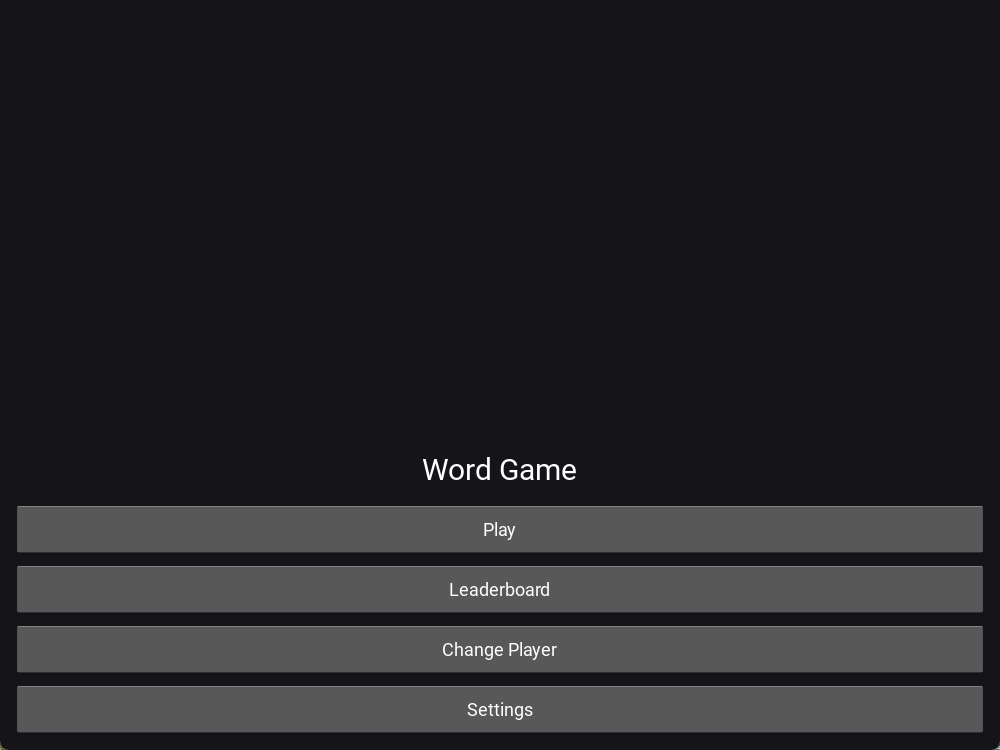
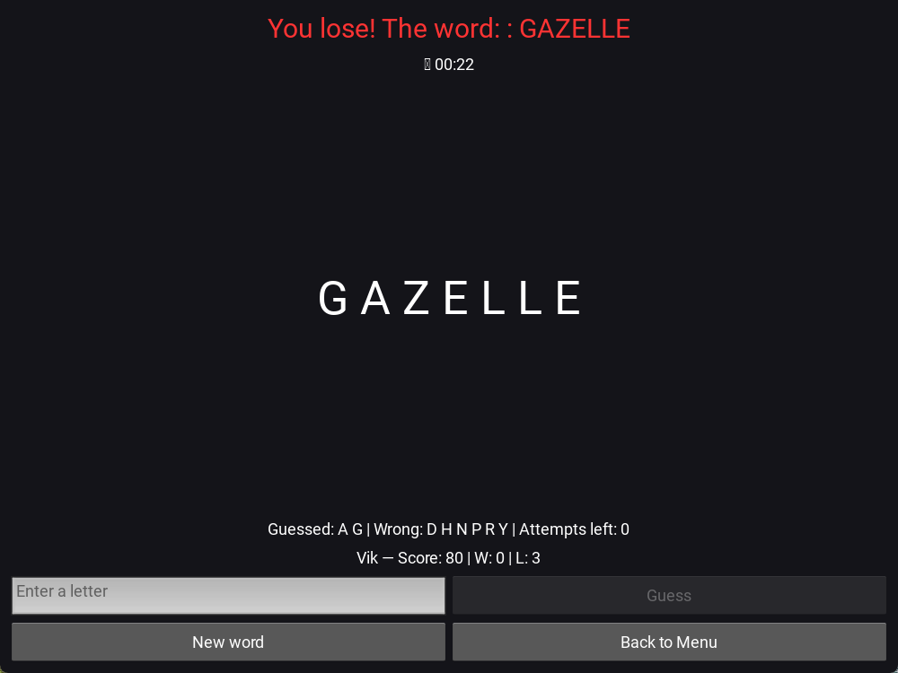

<<<<<<< HEAD
# Word Game Kivy

A compact word‑guessing game built with **Kivy (Python)** featuring a multi‑screen flow, local persistence, a leaderboard, sound effects, and custom animated widgets.

---

## 🧭 Overview

The app lets a player enter their name, pick a category, and guess a word. Progress and stats are saved locally (JSON). There’s a leaderboard aggregating wins/losses and score. The UI is composed of reusable widgets (e.g., `FancyButton`) and base screen helpers.
=======
# Word Game Kivy 🎮

A mini-game built with Kivy: guess the word within limited attempts.  
The project has been polished: full settings, animations, sounds, word sets by categories, and dev infrastructure.
>>>>>>> 6fdce8c (style: apply ruff/black auto-fixes)

---

## ✨ Features
<<<<<<< HEAD

- ScreenManager flow: Name → Menu → Category → Game → Leaderboard.
- Local JSON storage for players and stats.
- Leaderboard with sortable scores (wins/losses/points).
- Sound effects (click / win / lose).
- Custom animated buttons (`FancyButton`) and shared UI helpers.
- CI via GitHub Actions; dev tooling (Ruff, Black, isort, pytest).

---

## 🗂 Project Structure

```txt
word_game_kivy/
  word_game_kivy/
    game/
      player.py
    screens/
      base_screen.py
      name_screen.py
      menu_screen.py
      category_screen.py
      game_screen.py
      leaderboard_screen.py
    utils/
      storage.py
    widgets/
      fancy_button.py
    main.py
  requirements.txt
  requirements-dev.txt
  buildozer.spec
  tests/
  .github/workflows/ci.yml
```

> **Note:** The repository currently references assets (fonts, sounds) under `assets/...`. Make sure to add them or adjust code paths.

---

## ▶️ Run (Desktop)

**Prereqs:** Python 3.11+, pip, virtualenv recommended.

```bash
python -m venv .venv
# Windows
.venv\Scripts\activate
# macOS/Linux
=======
- 🎨 Themes: light and dark (applied instantly)
- 🔤 Font scaling (1.0× / 1.25× / 1.5×)
- ⏱ Round timer:
  - on/off
  - selectable length (30/60/90/120 seconds)
- 🎮 Difficulty levels:
  - Easy (10 attempts, simple words)
  - Normal (8 attempts, medium words)
  - Hard (6 attempts, rare words)
- 📚 Word categories:
  - Animals, Food, Countries (50 words in each category and difficulty)
- 🎹 Hotkeys:
  - Esc — back to menu
  - Ctrl+N — new word
- 🔊 Click sounds on every action (toggleable in settings)
- 🌀 Animation: word blinking on win/lose
- 📊 Player profiles, scores, wins/losses saved
- 🛠 Dev infra: `ruff`, `black`, `mypy`, `pytest`, GitHub Actions CI

---

## 📸 Screenshots & Demo
  
  
  
  
  

### 🎥 Demo


---

## 🚀 Installation & Run
```bash
git clone https://github.com/<username>/word_game_kivy.git
cd word_game_kivy

python -m venv .venv
# Windows:
.venv\Scripts\activate
# Linux/Mac:
>>>>>>> 6fdce8c (style: apply ruff/black auto-fixes)
source .venv/bin/activate

pip install -r requirements.txt

python -m word_game_kivy.main
```

<<<<<<< HEAD
If Kivy fails to start, check: <https://kivy.org/doc/stable/gettingstarted/installation.html>

---

## 📱 Android (Buildozer)

Requires Linux host or WSL (Windows).

```bash
pip install buildozer
buildozer init     # already present in repo
buildozer android debug
# APK will appear under bin/
```

---

## 🧪 Tests

=======
---

## 🧪 Tests & Development
>>>>>>> 6fdce8c (style: apply ruff/black auto-fixes)
```bash
pip install -r requirements-dev.txt
pytest -q
```

<<<<<<< HEAD
---

## ⚙️ Tooling

- **Ruff / Black / isort** for lint & format
- **pytest** for tests
- **GitHub Actions** for CI
=======
- `ruff`, `black`, `mypy` run automatically via pre-commit  
- GitHub Actions CI runs linting and tests on every push
>>>>>>> 6fdce8c (style: apply ruff/black auto-fixes)

---

## 🗺 Roadmap
<<<<<<< HEAD

- [ ] Add assets folder (fonts, SFX) or make paths configurable.
- [ ] Finish/verify missing parts in several screens where placeholders were used (`...`).
- [ ] Add type hints & docstrings across modules.
- [ ] Expand tests: game flow, leaderboard sorting, widget behavior.
- [ ] i18n (EN/RU) for UI text.
- [ ] In‑app settings (sound, difficulty).
- [ ] Packaging or itch.io page + screenshots/GIF.

---

## 📝 License

MIT — see `LICENSE`.
=======
- [x] Profile system
- [x] Leaderboard
- [x] Settings: theme, timer (on/off and length), scaling
- [x] Difficulty levels with separate word sets
- [x] Word categories with 50 words each
- [x] Sounds and animations
- [ ] Leaderboard export
- [ ] Android bundle (Buildozer)

---

## 📜 License
MIT © 2025 Nikita Creator
>>>>>>> 6fdce8c (style: apply ruff/black auto-fixes)
