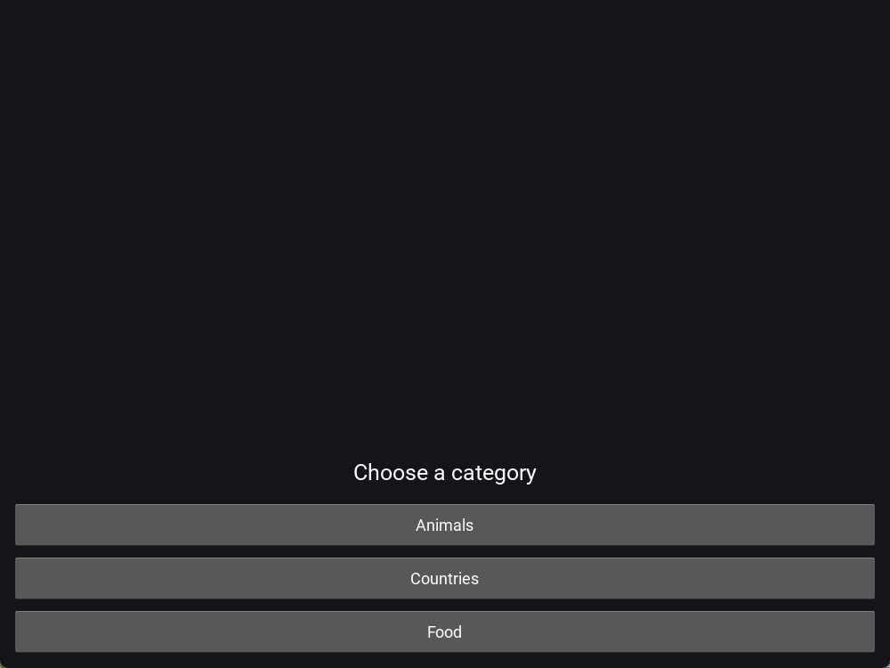
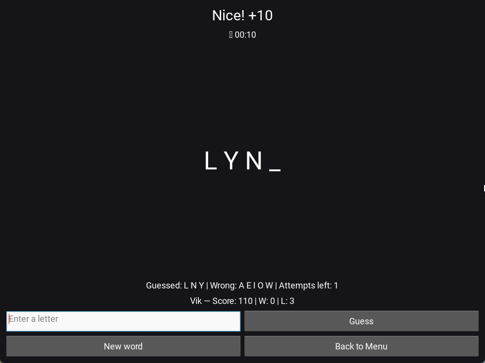
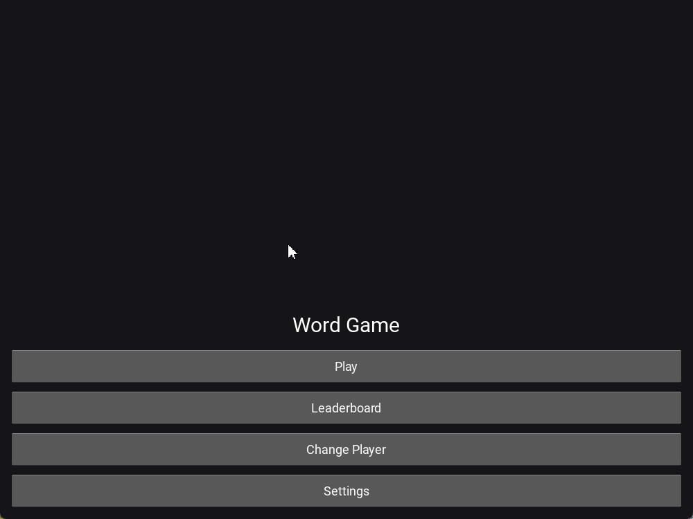

# Word Game Kivy 🎮

A mini-game built with Kivy: guess the word within limited attempts.  
The project has been polished: full settings, animations, sounds, word sets by categories, and dev infrastructure.

---

## ✨ Features
- 🎨 Themes: light and dark (applied instantly)
- 🔤 Font scaling (1.0× / 1.25× / 1.5×)
- ⏱ Round timer:
  - on/off
  - selectable length (30/60/90/120 seconds)
- 🎮 Difficulty levels:
  - Easy (10 attempts, simple words)
  - Normal (8 attempts, medium words)
  - Hard (6 attempts, rare words)
- 📚 Word categories:
  - Animals, Food, Countries (50 words in each category and difficulty)
- 🎹 Hotkeys:
  - Esc — back to menu
  - Ctrl+N — new word
- 🔊 Click sounds on every action (toggleable in settings)
- 🌀 Animation: word blinking on win/lose
- 📊 Player profiles, scores, wins/losses saved
- 🛠 Dev infra: `ruff`, `black`, `mypy`, `pytest`, GitHub Actions CI

---

## 📸 Screenshots & Demo
  
  
  
  
  

### 🎥 Demo


---

## 🚀 Installation & Run
```bash
git clone https://github.com/<username>/word_game_kivy.git
cd word_game_kivy

python -m venv .venv
# Windows:
.venv\Scripts\activate
# Linux/Mac:
source .venv/bin/activate

pip install -r requirements.txt

python -m word_game_kivy.main
```

---

## 🧪 Tests & Development
```bash
pip install -r requirements-dev.txt

# run tests
pytest -q

# run with coverage
pytest --cov=word_game_kivy --cov-report=term-missing
```

- `ruff`, `black`, `mypy` run automatically via pre-commit  
- GitHub Actions CI runs linting and tests on every push  
- Code coverage available via `pytest --cov`

---

## 🗺 Roadmap
- [x] Profile system
- [x] Leaderboard
- [x] Settings: theme, timer (on/off and length), scaling
- [x] Difficulty levels with separate word sets
- [x] Word categories with 50 words each
- [x] Sounds and animations
- [ ] Leaderboard export
- [ ] Android bundle (Buildozer)

---

## 📜 License
MIT © 2025 Nikita Creator
