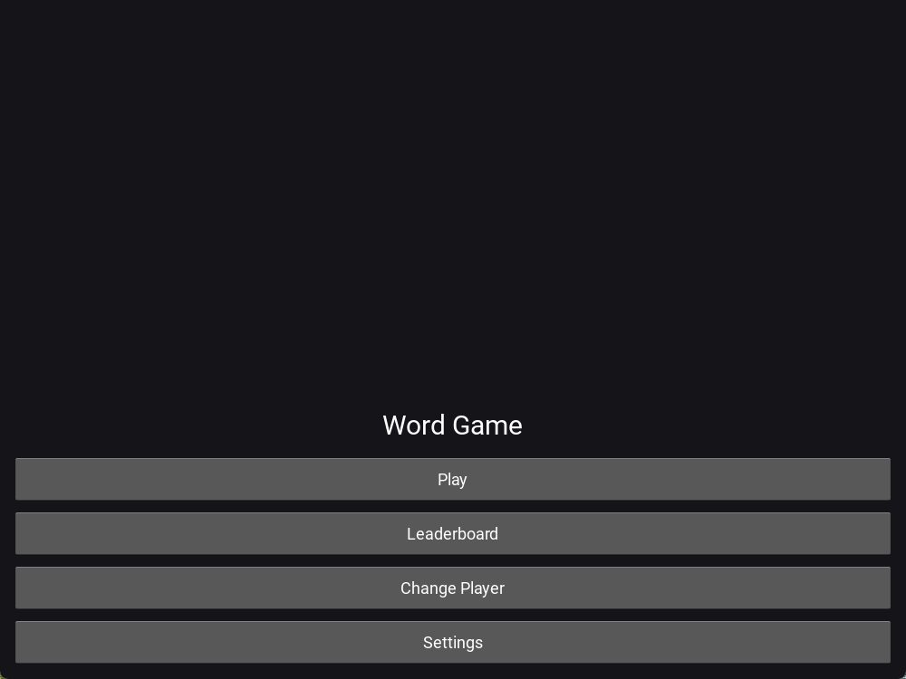
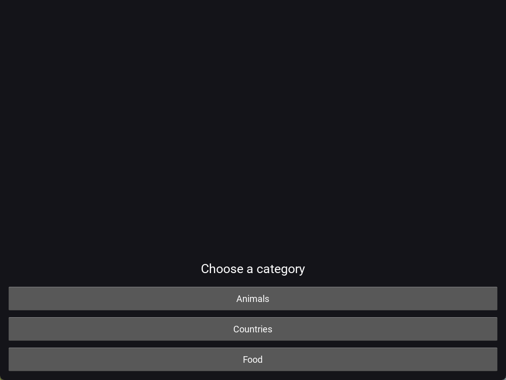
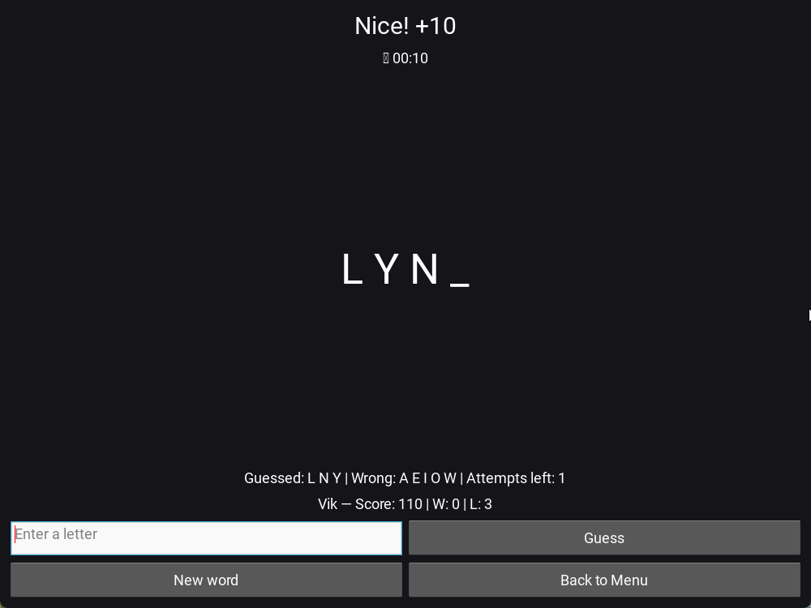
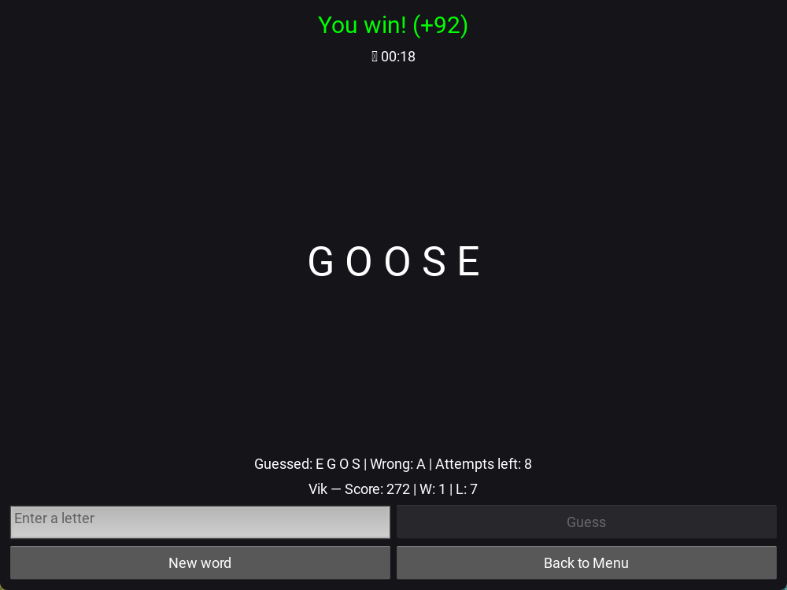
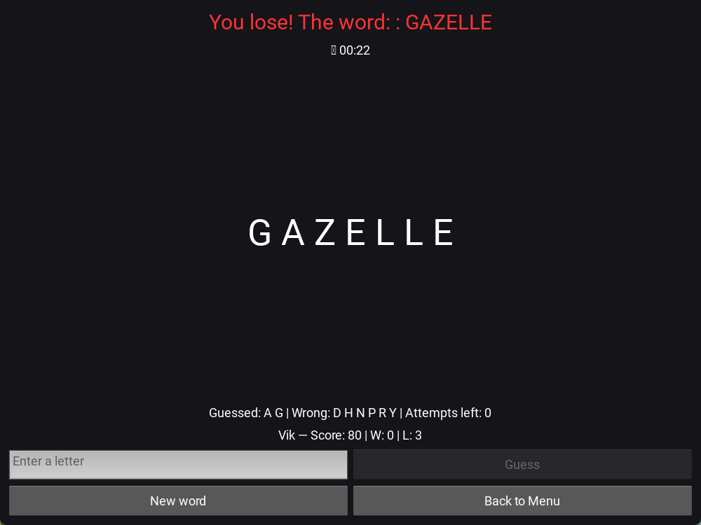
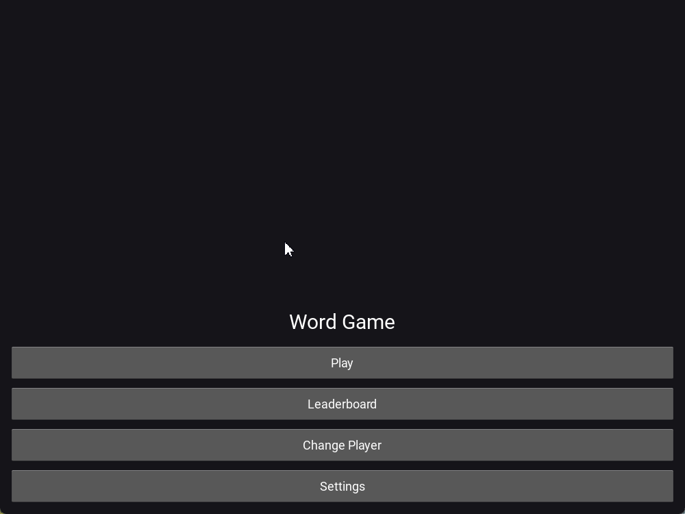

# Word Game Kivy 🎮

Мини-игра на Kivy: угадай слово за ограниченное число попыток.  
Проект доведён до уровня: полноценные настройки, анимации, звуки, словари по категориям и dev-инфра.

---

## ✨ Возможности
- 🎨 Темы: светлая и тёмная (применяются мгновенно)
- 🔤 Масштаб шрифта (1.0× / 1.25× / 1.5×)
- ⏱ Таймер раунда:
  - вкл/выкл
  - выбор длины (30/60/90/120 секунд)
- 🎮 Уровни сложности:
  - Easy (10 попыток, простые слова)
  - Normal (8 попыток, средние слова)
  - Hard (6 попыток, редкие слова)
- 📚 Категории слов:
  - Animals, Food, Countries (по 50 слов в каждой категории и уровне сложности)
- 🎹 Горячие клавиши:
  - Esc — вернуться в меню
  - Ctrl+N — новое слово
- 🔊 Щелчки на каждом действии (можно отключить в настройках)
- 🌀 Анимация: мерцание слова при победе/поражении
- 📊 Сохранение профиля, очков, побед/поражений
- 🛠 Dev-инфра: `ruff`, `black`, `mypy`, `pytest`, GitHub Actions CI

---

## 📸 Скриншоты и демо
  
  
  
  
  

### 🎥 Демо


---

## 🚀 Установка и запуск
```bash
git clone https://github.com/<username>/word_game_kivy.git
cd word_game_kivy

python -m venv .venv
# Windows:
.venv\Scripts\activate
# Linux/Mac:
source .venv/bin/activate

pip install -r requirements.txt

python -m word_game_kivy.main
```

---

## 🧪 Тесты и разработка
```bash
pip install -r requirements-dev.txt

# запуск тестов
pytest -q

# запуск с покрытием
pytest --cov=word_game_kivy --cov-report=term-missing
```

- `ruff`, `black`, `mypy` запускаются автоматически через pre-commit  
- GitHub Actions CI прогоняет линтеры и тесты при каждом push  
- Покрытие кода доступно через `pytest --cov`

---

## 🗺 Roadmap
- [x] Система профилей
- [x] Таблица лидеров
- [x] Настройки: тема, таймер (вкл/выкл и длина), масштаб
- [x] Уровни сложности с отдельными словарями
- [x] Категории слов по 50 слов в каждой
- [x] Звуки и анимации
- [ ] Экспорт лидерборда
- [ ] Бандл под Android (Buildozer)

---

## 📜 Лицензия
MIT © 2025 Nikita Creator
